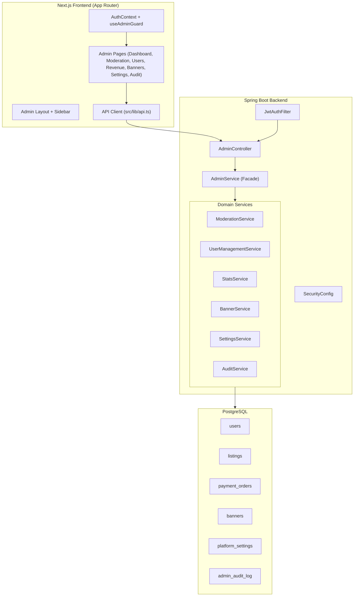
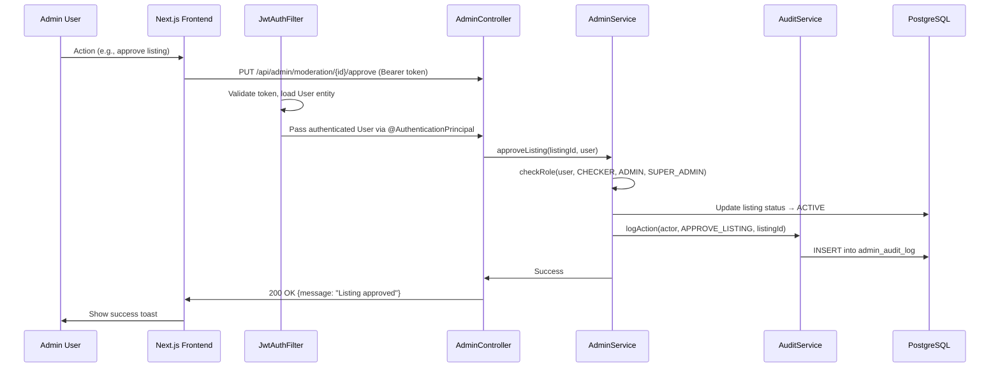
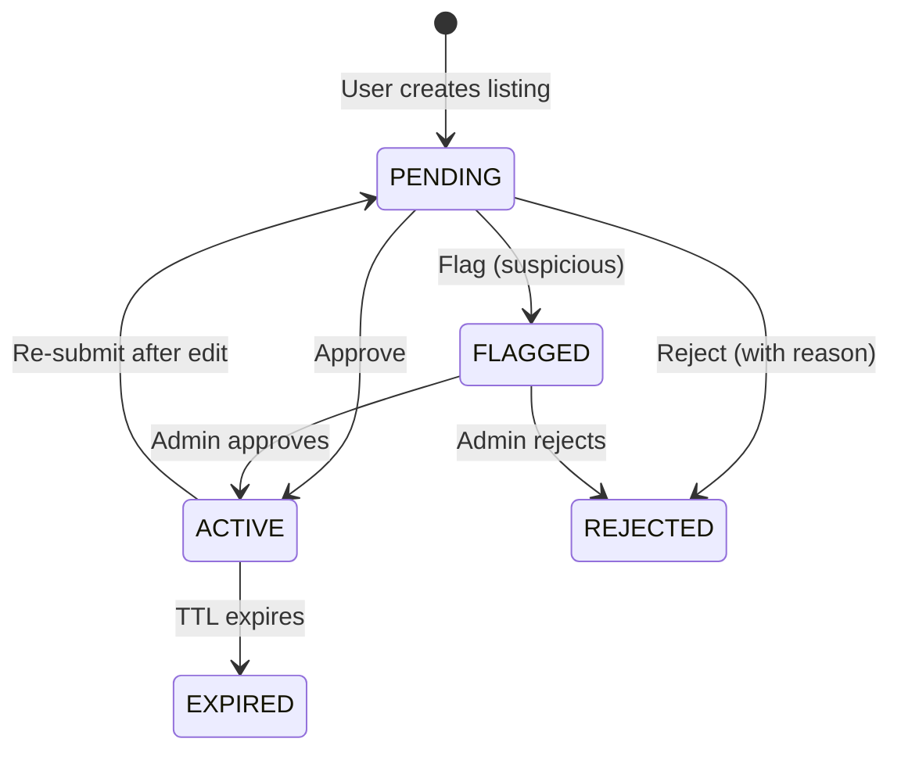

# Design Document: Admin Panel & Authorization System

## Overview

This design covers the full admin panel system for Deal Spot, an agricultural classifieds marketplace. The system provides role-based access control (RBAC) with 4 roles, a listing moderation workflow, revenue analytics, user management, platform promotions, system settings, and an audit trail.

The architecture extends the existing Spring Boot backend (JPA/Hibernate + PostgreSQL) and Next.js frontend (App Router + shadcn/ui). The admin panel reuses the existing JWT auth system, adding role-based middleware on both frontend and backend. The existing entity models (`User`, `Listing`, `Banner`, `PlatformSetting`, `AuditLog`, `PaymentOrder`) already contain the necessary fields — this design focuses on the service layer logic, API contracts, security enforcement, and frontend integration.

### Key Design Decisions

1. **Role enforcement at service layer** — Role checks happen in the service layer via `AdminService.checkRole()` (already implemented). This keeps controllers thin and allows reuse across different entry points.
2. **No separate admin auth endpoint** — The existing `/api/auth/login` returns a JWT. The frontend checks `user.role` to grant admin panel access. This avoids duplicating auth logic.
3. **Audit as cross-cutting concern** — `AuditService` is injected into all admin services and logs every mutation. Audit logs are append-only (no UPDATE/DELETE operations exposed).
4. **Frontend role gating** — A `useAdminGuard` hook redirects unauthorized users. Each page declares its minimum required role.
5. **Moderation as state machine** — Listing status transitions are enforced programmatically. Invalid transitions throw exceptions.

---

## Architecture

### High-Level System Architecture



### Request Flow



---

## Components and Interfaces

### Backend Components

#### 1. AdminController (existing, to be extended)
Entry point for all admin API calls. Already handles routing and passes `@AuthenticationPrincipal User`.

#### 2. AdminService (existing facade)
Delegates to domain services. Already implemented as a coordination layer.

#### 3. ModerationService
- `getModerationQueue(page, size)` → Returns PENDING listings ordered by `createdAt` ASC (FIFO)
- `approveListing(listingId, moderator)` → PENDING → ACTIVE, sets moderatedBy/moderatedAt
- `rejectListing(listingId, reason, moderator)` → PENDING → REJECTED, sets rejectionReason
- `flagListing(listingId, moderator)` → PENDING → FLAGGED, escalates to ADMIN
- `featureListing(listingId, featured, actor)` → Toggles `featured` flag

**State Machine:**


#### 4. UserManagementService
- `checkRole(user, allowedRoles...)` → Throws 403 if user role not in allowed list
- `getAllUsers(page, size, search)` → Paginated user list with optional name/phone search
- `banUser(userId, reason, actor)` → Sets banned=true, clears refresh tokens
- `unbanUser(userId, actor)` → Sets banned=false
- `changeUserRole(targetUserId, newRole, actor)` → Only SUPER_ADMIN can call. Validates role escalation rules.

#### 5. StatsService
- `getDashboardStats()` → KPI aggregation (counts + sums)
- `getRevenueStats(from, to)` → Daily revenue breakdown, category split
- `getUserGrowthStats()` → Daily registration counts
- `getListingStats()` → Category distribution, status breakdown

#### 6. BannerService
- CRUD for banners with date-range activation
- `getActiveBanners()` → Filters by `active=true` AND current date between start/end

#### 7. SettingsService
- Key-value store for platform configuration
- `getAllSettings()` / `updateSetting(key, value, actor)`

#### 8. AuditService
- `logAction(actorId, action, targetType, targetId, details)` → Append-only insert
- `getAuditLogs(page, size)` → Paginated, newest first

### Frontend Components

#### 1. useAdminGuard Hook
```typescript
function useAdminGuard(minimumRole: 'CHECKER' | 'ADMIN' | 'SUPER_ADMIN'): {
  isAuthorized: boolean;
  isLoading: boolean;
}
```
Redirects to `/login` if not authenticated or role insufficient.

#### 2. Admin Layout (existing)
Sidebar navigation with role-based visibility. Already implemented.

#### 3. Admin Pages
Each page is a client component that:
1. Calls `useAdminGuard` with its minimum role
2. Fetches data from the API client
3. Renders tables/cards using shadcn/ui components

---

## Data Models

### Existing Entities (already in codebase)

#### User Entity
```java
@Entity @Table(name = "users")
public class User {
    Long id;
    String phone;           // unique
    String email;           // unique, optional
    String password;        // bcrypt hashed
    String name;
    String location;
    String district;
    String role;            // "USER", "CHECKER", "ADMIN", "SUPER_ADMIN"
    Boolean banned;         // default false
    String banReason;
    LocalDateTime bannedAt;
    LocalDateTime createdAt;
    LocalDateTime updatedAt;
}
```

#### Listing Entity
```java
@Entity @Table(name = "listings")
public class Listing {
    Long id;
    String title;
    String description;
    String category;
    Double price;
    String status;              // "PENDING", "ACTIVE", "REJECTED", "FLAGGED", "SOLD", "EXPIRED"
    Boolean featured;           // default false
    Boolean promoted;           // default false
    String rejectionReason;
    User moderatedBy;           // FK to users
    LocalDateTime moderatedAt;
    LocalDateTime expiresAt;
    User user;                  // FK to seller
    LocalDateTime createdAt;
    List<String> images;
    Integer viewCount;
}
```

#### PaymentOrder Entity
```java
@Entity @Table(name = "payment_orders")
public class PaymentOrder {
    Long id;
    User user;              // FK: who paid
    Listing listing;        // FK: which listing
    String razorpayOrderId;
    String razorpayPaymentId;
    Integer amount;         // in paise (5000 = ₹50)
    String status;          // "CREATED", "PAID", "FAILED", "REFUNDED"
    String purpose;         // "CONTACT_UNLOCK"
    LocalDateTime createdAt;
    LocalDateTime paidAt;
}
```

#### Banner Entity
```java
@Entity @Table(name = "banners")
public class Banner {
    Long id;
    String title;
    String subtitle;
    String imageUrl;
    String link;
    String color;
    Boolean active;
    LocalDateTime startDate;
    LocalDateTime endDate;
    User createdBy;         // FK
    LocalDateTime createdAt;
}
```

#### PlatformSetting Entity
```java
@Entity @Table(name = "platform_settings")
public class PlatformSetting {
    String key;             // PK
    String value;
    Long updatedBy;
    LocalDateTime updatedAt;
}
```

#### AuditLog Entity
```java
@Entity @Table(name = "admin_audit_log")
public class AuditLog {
    Long id;
    Long actorId;
    String action;          // e.g., "APPROVE_LISTING", "BAN_USER", "CHANGE_ROLE"
    String targetType;      // "LISTING", "USER", "BANNER", "SETTING"
    Long targetId;
    String details;         // JSON text with context
    LocalDateTime createdAt;
}
```

### Database Schema (PostgreSQL DDL)

```sql
-- Role hierarchy: USER < CHECKER < ADMIN < SUPER_ADMIN

-- Default platform settings (seeded)
INSERT INTO platform_settings (key, value, updated_by, updated_at) VALUES
  ('contact_unlock_price', '5000', NULL, NOW()),      -- in paise
  ('max_images_per_listing', '5', NULL, NOW()),
  ('listing_expiry_days', '30', NULL, NOW()),
  ('maintenance_mode', 'false', NULL, NOW());

-- Seed SUPER_ADMIN (first deploy)
INSERT INTO users (phone, password, name, role, created_at)
VALUES ('+919999999999', '$2a$10$...', 'Super Admin', 'SUPER_ADMIN', NOW());
```

### API Contracts

#### Moderation

| Method | Endpoint | Role | Request Body | Response |
|--------|----------|------|--------------|----------|
| GET | `/api/admin/moderation/queue?page=0&size=20` | CHECKER+ | - | `Page<ListingResponse>` |
| PUT | `/api/admin/moderation/{id}/approve` | CHECKER+ | - | `{message: string}` |
| PUT | `/api/admin/moderation/{id}/reject` | CHECKER+ | `{reason: string}` | `{message: string}` |
| PUT | `/api/admin/moderation/{id}/flag` | CHECKER+ | - | `{message: string}` |

#### User Management

| Method | Endpoint | Role | Request Body | Response |
|--------|----------|------|--------------|----------|
| GET | `/api/admin/users?page=0&size=20&search=` | ADMIN+ | - | `Page<UserResponse>` |
| PUT | `/api/admin/users/{id}/ban` | ADMIN+ | `{reason: string}` | `{message: string}` |
| PUT | `/api/admin/users/{id}/unban` | ADMIN+ | - | `{message: string}` |
| PUT | `/api/admin/users/{id}/role` | SUPER_ADMIN | `{role: string}` | `{message: string}` |

#### Revenue & Stats

| Method | Endpoint | Role | Response |
|--------|----------|------|----------|
| GET | `/api/admin/stats/dashboard` | ADMIN+ | `DashboardStats` |
| GET | `/api/admin/stats/revenue?from=&to=` | ADMIN+ | `RevenueStats` |
| GET | `/api/admin/stats/transactions?page=0&size=20` | ADMIN+ | `Page<PaymentOrder>` |

#### Banners

| Method | Endpoint | Role | Request Body | Response |
|--------|----------|------|--------------|----------|
| GET | `/api/admin/banners` | ADMIN+ | - | `List<BannerResponse>` |
| POST | `/api/admin/banners` | ADMIN+ | `CreateBannerRequest` | `BannerResponse` |
| DELETE | `/api/admin/banners/{id}` | ADMIN+ | - | `{message: string}` |
| PUT | `/api/admin/listings/{id}/feature` | ADMIN+ | - | `{message: string}` |
| PUT | `/api/admin/listings/{id}/unfeature` | ADMIN+ | - | `{message: string}` |

#### Settings

| Method | Endpoint | Role | Request Body | Response |
|--------|----------|------|--------------|----------|
| GET | `/api/admin/settings` | SUPER_ADMIN | - | `Map<String, String>` |
| PUT | `/api/admin/settings` | SUPER_ADMIN | `Map<String, String>` | `{message: string}` |

#### Audit

| Method | Endpoint | Role | Response |
|--------|----------|------|----------|
| GET | `/api/admin/audit?page=0&size=50` | SUPER_ADMIN | `Page<AuditLog>` |

### Response DTOs

```typescript
// Frontend types (src/lib/api.ts)
interface DashboardStats {
  totalUsers: number;
  totalListings: number;
  activeListings: number;
  pendingModeration: number;
  totalRevenue: number;        // in paise
  todayRevenue: number;
  monthRevenue: number;
  totalUnlocks: number;
  todayUnlocks: number;
  conversionRate: number;      // percentage
}

interface RevenueStats {
  totalRevenue: number;
  dailyRevenue: { date: string; amount: number }[];
  categoryBreakdown: { category: string; amount: number; count: number }[];
  failedPayments: number;
  refundedPayments: number;
}

interface UserResponse {
  id: number;
  phone: string;
  name: string;
  email?: string;
  location?: string;
  district?: string;
  role: string;
  banned: boolean;
  banReason?: string;
  listingCount: number;
  createdAt: string;
}

interface BannerResponse {
  id: number;
  title: string;
  subtitle?: string;
  imageUrl?: string;
  link?: string;
  color?: string;
  active: boolean;
  startDate?: string;
  endDate?: string;
  createdAt: string;
}

interface AuditLogEntry {
  id: number;
  actorId: number;
  actorName: string;
  action: string;
  targetType: string;
  targetId: number;
  details: string;
  createdAt: string;
}
```

### Key Algorithms

#### Role Hierarchy Check
```java
public void checkRole(User user, String... allowedRoles) {
    if (user == null || !Arrays.asList(allowedRoles).contains(user.getRole())) {
        throw new AccessDeniedException("Insufficient permissions");
    }
}
```

#### Role Change Validation
```java
public void changeUserRole(Long targetUserId, String newRole, User actor) {
    // Only SUPER_ADMIN can change roles
    checkRole(actor, "SUPER_ADMIN");
    
    // Cannot change own role
    if (actor.getId().equals(targetUserId)) {
        throw new IllegalArgumentException("Cannot change own role");
    }
    
    // Validate target role
    List<String> validRoles = List.of("USER", "CHECKER", "ADMIN");
    if (!validRoles.contains(newRole)) {
        throw new IllegalArgumentException("Invalid role: " + newRole);
    }
    
    // Cannot promote to SUPER_ADMIN
    if ("SUPER_ADMIN".equals(newRole)) {
        throw new IllegalArgumentException("Cannot assign SUPER_ADMIN role");
    }
    
    User target = userRepository.findById(targetUserId)
        .orElseThrow(() -> new NotFoundException("User not found"));
    target.setRole(newRole);
    userRepository.save(target);
    
    auditService.log(actor.getId(), "CHANGE_ROLE", "USER", targetUserId, 
        Map.of("oldRole", target.getRole(), "newRole", newRole));
}
```

#### Listing Status Transition Validation
```java
private static final Map<String, Set<String>> VALID_TRANSITIONS = Map.of(
    "PENDING", Set.of("ACTIVE", "REJECTED", "FLAGGED"),
    "FLAGGED", Set.of("ACTIVE", "REJECTED"),
    "ACTIVE",  Set.of("PENDING", "EXPIRED")
);

public void transitionStatus(Listing listing, String newStatus) {
    Set<String> allowed = VALID_TRANSITIONS.getOrDefault(listing.getStatus(), Set.of());
    if (!allowed.contains(newStatus)) {
        throw new IllegalStateException(
            "Cannot transition from " + listing.getStatus() + " to " + newStatus);
    }
    listing.setStatus(newStatus);
}
```

#### Ban User with Token Revocation
```java
public void banUser(Long userId, String reason, User actor) {
    checkRole(actor, "ADMIN", "SUPER_ADMIN");
    User target = userRepository.findById(userId)
        .orElseThrow(() -> new NotFoundException("User not found"));
    
    // Cannot ban admins (only SUPER_ADMIN can ban other admins)
    if (List.of("ADMIN", "SUPER_ADMIN").contains(target.getRole()) 
        && !"SUPER_ADMIN".equals(actor.getRole())) {
        throw new AccessDeniedException("Cannot ban admin users");
    }
    
    target.setBanned(true);
    target.setBanReason(reason);
    target.setBannedAt(LocalDateTime.now());
    userRepository.save(target);
    
    // Revoke all refresh tokens
    refreshTokenRepository.deleteByUser(target);
    
    auditService.log(actor.getId(), "BAN_USER", "USER", userId, 
        Map.of("reason", reason));
}
```

---


## Correctness Properties

*A property is a characteristic or behavior that should hold true across all valid executions of a system — essentially, a formal statement about what the system should do. Properties serve as the bridge between human-readable specifications and machine-verifiable correctness guarantees.*

### Property 1: Role enforcement grants access if and only if role is sufficient

*For any* user with a given role and any admin operation with a minimum required role level, the `checkRole` function SHALL allow access if and only if the user's role is in the set of allowed roles for that operation. The role hierarchy is: USER < CHECKER < ADMIN < SUPER_ADMIN.

**Validates: Requirements REQ-AUTH-02, REQ-MOD-02, REQ-AUD-06**

### Property 2: Role change rules are comprehensive and non-bypassable

*For any* actor and target user, role assignment SHALL succeed only when ALL of the following hold: (a) actor has role SUPER_ADMIN, (b) target is a different user than actor, (c) the new role is one of USER, CHECKER, or ADMIN (never SUPER_ADMIN). In all other cases, the operation SHALL throw an exception and leave the target user's role unchanged.

**Validates: Requirements REQ-AUTH-03, REQ-AUTH-05, REQ-USR-06, REQ-USR-07**

### Property 3: Listing status transitions follow the state machine

*For any* listing with a current status and any attempted new status, the transition SHALL succeed only if the (currentStatus → newStatus) pair is in the set of valid transitions: {PENDING→ACTIVE, PENDING→REJECTED, PENDING→FLAGGED, FLAGGED→ACTIVE, FLAGGED→REJECTED, ACTIVE→PENDING, ACTIVE→EXPIRED}. All other transitions SHALL be rejected.

**Validates: Requirements REQ-MOD-01, REQ-MOD-02**

### Property 4: Rejection requires a non-empty reason

*For any* listing rejection operation, if the reason is null, empty, or whitespace-only, the system SHALL reject the operation and leave the listing status unchanged. If the reason is non-empty, and the user has sufficient role, the rejection SHALL succeed and store the reason.

**Validates: Requirements REQ-MOD-03**

### Property 5: Moderation queue maintains FIFO ordering

*For any* set of listings with status PENDING, the moderation queue SHALL return them ordered by `createdAt` ascending (oldest first). For any two listings A and B in the queue, if A.createdAt < B.createdAt, then A SHALL appear before B in the results.

**Validates: Requirements REQ-MOD-06**

### Property 6: Revenue totals exclude non-successful payments

*For any* set of payment records and any date range, the revenue total SHALL equal the sum of `amount` for payments where status = "PAID" and `paidAt` falls within the range. Payments with status CREATED, FAILED, or REFUNDED SHALL NOT be included in revenue totals. The sum of category breakdowns SHALL equal the total revenue.

**Validates: Requirements REQ-REV-01, REQ-REV-02, REQ-REV-04**

### Property 7: Ban/unban is a round-trip that restores user state

*For any* non-banned user, banning then immediately unbanning SHALL result in `banned = false` and `banReason = null`. Conversely, for any banned user, unbanning then banning with a new reason SHALL result in `banned = true` with the new reason stored.

**Validates: Requirements REQ-USR-03, REQ-USR-05**

### Property 8: Banned users are denied authentication

*For any* user with `banned = true`, the authentication system SHALL reject login attempts regardless of correct credentials. The system SHALL return an appropriate error indicating the account is banned.

**Validates: Requirements REQ-USR-04**

### Property 9: Audit log is append-only and monotonically growing

*For any* sequence of admin operations, the audit log entry count after each operation SHALL be greater than or equal to the count before the operation. No operation SHALL decrease the audit log count. Every admin mutation (moderation, ban/unban, role change, setting update, banner CRUD) SHALL produce exactly one new audit log entry.

**Validates: Requirements REQ-AUD-01, REQ-AUD-02, REQ-AUD-03, REQ-AUD-04, REQ-AUD-05**

### Property 10: Transaction filter results respect filter criteria

*For any* date range filter [from, to] applied to the transaction history, every returned transaction SHALL have its `createdAt` timestamp within that range (inclusive). No transaction outside the range SHALL appear in filtered results.

**Validates: Requirements REQ-REV-03**

---

## Error Handling

### Backend Error Strategy

All admin endpoints use Spring's `@ControllerAdvice` for consistent error responses:

```java
// Error response format
{
  "error": "Human readable message",
  "code": "ERROR_CODE",
  "timestamp": "2026-07-12T10:30:00Z"
}
```

| Scenario | HTTP Status | Error Code | Message |
|----------|-------------|------------|---------|
| User not authenticated | 401 | `UNAUTHORIZED` | "Authentication required" |
| Insufficient role | 403 | `FORBIDDEN` | "Insufficient permissions" |
| User/Listing not found | 404 | `NOT_FOUND` | "Resource not found" |
| Invalid state transition | 400 | `INVALID_TRANSITION` | "Cannot transition from X to Y" |
| Rejection without reason | 400 | `VALIDATION_ERROR` | "Rejection reason is required" |
| Invalid role value | 400 | `INVALID_ROLE` | "Invalid role: X" |
| Cannot ban self | 400 | `SELF_ACTION` | "Cannot ban yourself" |
| Cannot change own role | 400 | `SELF_ACTION` | "Cannot change own role" |
| User already banned | 409 | `CONFLICT` | "User is already banned" |
| Banned user login | 403 | `ACCOUNT_BANNED` | "Account is banned: {reason}" |

### Frontend Error Handling

- API errors are caught in `api.ts` `request()` method
- 401 → Redirect to login page (existing behavior)
- 403 → Show "Access Denied" toast and redirect to admin dashboard
- 400 → Show validation error toast with server message
- 404 → Show "Not found" message
- Network errors → Show "Connection error" toast with retry option

### Circuit Breaker for Dashboard Stats

Since dashboard stats involve multiple aggregate queries, the frontend uses stale-while-revalidate:
- Cache stats for 30 seconds
- Show cached data immediately, refresh in background
- If refresh fails, keep showing stale data with "Last updated: X" indicator

---

## Testing Strategy

### Unit Tests (Example-Based)

Focus on specific scenarios and edge cases:

- **Role check edge cases**: Null user, empty role string, invalid role value
- **State machine boundaries**: Each valid transition with correct assertions
- **Banner CRUD**: Create with all fields, create with minimum fields, delete non-existent
- **Settings**: Get/set individual settings, update multiple at once
- **Dashboard stats**: Verify correct aggregation with known test data
- **CSV export**: Correct headers, proper escaping of special characters

### Property-Based Tests

Using **jqwik** (Java) for backend property tests and **fast-check** (TypeScript) for frontend logic tests.

**Configuration**: Minimum 100 iterations per property test.

**Backend Properties (jqwik):**
1. Role enforcement — generate random (role, endpoint) pairs, verify access control
2. Role change rules — generate random (actor, target, newRole) triples
3. State machine — generate random (currentStatus, newStatus) pairs
4. Rejection reason validation — generate random strings including edge cases
5. FIFO ordering — generate random listing sets with random timestamps
6. Revenue aggregation — generate random payment sets, verify sums
7. Ban/unban round-trip — generate random users, ban then unban
8. Audit monotonicity — generate random operation sequences

**Frontend Properties (fast-check):**
- Role hierarchy comparison logic (if extracted to a utility)
- Pagination parameter validation

### Integration Tests

- Full moderation workflow: create listing → pending → approve → active
- Ban user → verify login rejected → unban → verify login works
- Revenue calculation with real DB data (TestContainers + PostgreSQL)
- Audit trail completeness after sequence of operations

### Test Tag Format

Each property test must be tagged:
```
Feature: admin-panel, Property {N}: {property_text}
```

Example:
```java
@Property
@Tag("Feature: admin-panel, Property 1: Role enforcement grants access if and only if role is sufficient")
void roleEnforcement(@ForAll("validRoles") String userRole, @ForAll("adminOperations") String operation) {
    // ...
}
```
